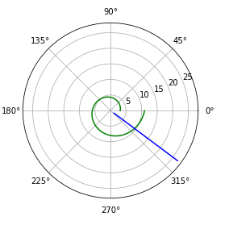
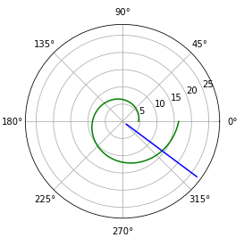

---
## Front matter
lang: ru-RU
title: "Отчет по лабораторной работе 2"
author: |
	Savchenkov D.A.\inst{1}
institute: |
	\inst{1}RUDN University, Moscow, Russian Federation
date: 26 February, 2021 Moscow, Russian Federation

## Formatting
toc: false
slide_level: 2
theme: metropolis
header-includes: 
 - \metroset{progressbar=frametitle,sectionpage=progressbar,numbering=fraction}
 - '\makeatletter'
 - '\beamer@ignorenonframefalse'
 - '\makeatother'
aspectratio: 43
section-titles: true
---

# **Прагматика выполнения лабораторной работы**

## Зачем?

Каждый, занимающийся математическим моделированием, должен уметь:

* Использовать математический аппарат для решения задач
* Моделировать задачи

# **Цель выполнения лабораторной работы**

## Цель

Решить задачу о погоне, построить графики с помощью Python.

# **Задачи выполнения лабораторной работы**

## Вариант 38

На море в тумане катер береговой охраны преследует лодку браконьеров.
Через определенный промежуток времени туман рассеивается, и лодка обнаруживается 
на расстоянии 19 км от катера. Затем лодка снова скрывается в тумане и уходит 
прямолинейно в неизвестном направлении. Известно, что скорость катера в 5,1 раза 
больше скорости браконьерской лодки.

## Задание

1. Вывести дифференциальное уравнение, описывающее движение катера, с начальными условиями.
2. Построить траектории движения катера и лодки для двух случаев.
3. Определить точку пересечения катера и лодки.

# **Результаты выполнения лабораторной работы**

## Дифференциальное уравнение. Начальные условия

В ходе рассуждений я вывел дифференциальное уравнение, описывающее движение катера:
$$ \frac{\partial r}{\partial θ} = \sqrt{25,01}v $$

А начальные условия получились следующие:
\begin{equation*}
  \begin{cases}
    θ_{0} = 0 
    \\ 
    r_{0} = x_{1} = \frac{10}{61}k
  \end{cases}
\end{equation*}

\begin{equation*}
  \begin{cases}
    θ_{0} = 0 
    \\ 
    r_{0} = x_{2} = \frac{10}{41}k
  \end{cases}
\end{equation*}

## Траектории движения

Сначала я написал программу на Python, строющую графики траекторий:
```
#функция, описывающая движение катера береговой охраны
def dr(r, tetha): 
    dr = r/math.sqrt(25.01)
    return dr

#функция, описывающая движение лодки браконьеров
def xt(t): 
    xt = math.tan(fi)*t
    return xt
```

## 

```
#построение траектории движения катера в полярных координатах. 1 случай
plt.polar(te, r1, 'g')
#построение траектории движения лодки в полярных координатах
plt.polar(tete, rr, 'b') 

#построение траектории движения катера в полярных координатах. 2 случай
plt.polar(te, r2, 'g')
#построение траектории движения лодки в полярных координатах
plt.polar(tete, rr, 'b')
```

## Траектории движения катера и лодки. 1 случай

{ #fig:001 width=70% } 

## Траектории движения катера и лодки. 2 случай

{ #fig:004 width=70% }

## Точка пересечения

Для нахождения точки пересечения графиков я добавил в конец программы следующее:
```
#для 1 случая
idx = np.argwhere(np.diff(np.sign(rr - r1))).flatten()
print (tete[-1])
print (rr[idx[-1]])

#для 2 случая
idd = np.argwhere(np.diff(np.sign(rr - r2))).flatten()
print (tete[-1])
print (rr[idd[-1]])
```

Получил значения: $θ = -0.6420926159343304, r = 9.899494936611667$ - 1 случай, $θ = -0.6420926159343304, r = 15.556349186104047$ - 2 случай

## Вывод

Решил задачу о погоне, построил графики с помощью Python.

## {.standout}

Спасибо за внимание!
