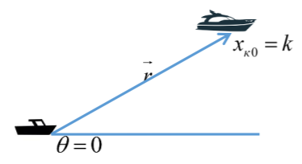
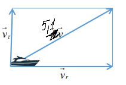
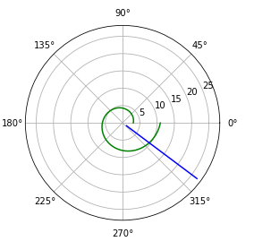
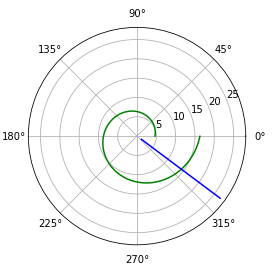

---
# Front matter
lang: ru-RU
title: "Отчёт по лабораторной работе 2"
subtitle: "дисциплина: Математическое моделирование"
author: "Савченков Д.А., НПИбд-02-18"

# Formatting
toc-title: "Содержание"
toc: true # Table of contents
toc_depth: 2
lof: true # List of figures
lot: true # List of tables
fontsize: 12pt
linestretch: 1.5
papersize: a4paper
documentclass: scrreprt
polyglossia-lang: russian
polyglossia-otherlangs: english
mainfont: PT Serif
romanfont: PT Serif
sansfont: PT Sans
monofont: PT Mono
mainfontoptions: Ligatures=TeX
romanfontoptions: Ligatures=TeX
sansfontoptions: Ligatures=TeX,Scale=MatchLowercase
monofontoptions: Scale=MatchLowercase
indent: true
pdf-engine: lualatex
header-includes:
  - \linepenalty=10 # the penalty added to the badness of each line within a paragraph (no associated penalty node) Increasing the value makes tex try to have fewer lines in the paragraph.
  - \interlinepenalty=0 # value of the penalty (node) added after each line of a paragraph.
  - \hyphenpenalty=50 # the penalty for line breaking at an automatically inserted hyphen
  - \exhyphenpenalty=50 # the penalty for line breaking at an explicit hyphen
  - \binoppenalty=700 # the penalty for breaking a line at a binary operator
  - \relpenalty=500 # the penalty for breaking a line at a relation
  - \clubpenalty=150 # extra penalty for breaking after first line of a paragraph
  - \widowpenalty=150 # extra penalty for breaking before last line of a paragraph
  - \displaywidowpenalty=50 # extra penalty for breaking before last line before a display math
  - \brokenpenalty=100 # extra penalty for page breaking after a hyphenated line
  - \predisplaypenalty=10000 # penalty for breaking before a display
  - \postdisplaypenalty=0 # penalty for breaking after a display
  - \floatingpenalty = 20000 # penalty for splitting an insertion (can only be split footnote in standard LaTeX)
  - \raggedbottom # or \flushbottom
  - \usepackage{float} # keep figures where there are in the text
  - \floatplacement{figure}{H} # keep figures where there are in the text
---

# Цель работы

Решить задачу о погоне, построить графики с помощью Python.

# Задание

**Вариант 38**
На море в тумане катер береговой охраны преследует лодку браконьеров.
Через определенный промежуток времени туман рассеивается, и лодка обнаруживается 
на расстоянии 19 км от катера. Затем лодка снова скрывается в тумане и уходит 
прямолинейно в неизвестном направлении. Известно, что скорость катера в 5.1 раза 
больше скорости браконьерской лодки.

1. Вывести дифференциальное уравнение, описывающее движение катера, с начальными условиями.
2. Построить траектории движения катера и лодки для двух случаев.
3. Определить точку пересечения катера и лодки.


# Выполнение лабораторной работы

**1. Вывод дифференциального уравнения**

1.1. Принимаем за $t_{0} = 0$, $x_{Л0} = 0$ -- место нахождения лодки браконьеров 
в момент обнаружения, $x_{К0} = 17,4$ км -- место нахождения катера береговой охраны 
относительно лодки браконьеров в момент обнаружения лодки.

1.2. Введем полярные координаты. Считаем, что полюс – это точка обнаружения лодки 
браконьеров $x_{Л0} (θ = x_{Л0} = 0)$, а полярная ось $r$ проходит через точку нахождения 
катера береговой охраны. (см. рис. -@fig:001)

{ #fig:001 width=70% }

1.3. Траектория катера должна быть такой, чтобы и катер, и лодка все время были 
на одном расстоянии от полюса $θ$, только в этом случае траектория катера пересечется с 
траекторией лодки. Поэтому для начала катер береговой охраны должен двигаться некоторое 
время прямолинейно, пока не окажется на том же расстоянии от полюса, что и лодка браконьеров. 
После этого катер береговой охраны должен двигаться вокруг полюса удаляясь от него с той же 
скоростью, что и лодка браконьеров.

1.4. Чтобы найти расстояние x (расстояние, после которого катер начнет двигаться 
вокруг полюса), необходимо составить простое уравнение. Пусть через время $t$ катер и лодка 
окажутся на одном расстоянии x от полюса. За это время лодка пройдет $x$, а катер $19 - x$ (или 
$19 + x$, в зависимости от начального положения катера относительно полюса). Время, за которое 
они пройдут это расстояние, вычисляется как x / v  или 19 - x / 5,1v (во втором 
случае 19 + x / 5,1v). Так как время одно и то же, то эти величины одинаковы. Тогда 
неизвестное расстояние $x$ можно найти из следующего(-их) уравнения(-й):
$$ \frac{x}{v} = \frac{19-x}{5,1v}$$
$$ \frac{x}{v} = \frac{19+x}{5,1v}$$

Тогда $x_{1} = \frac{10k}{61} = \frac{190}{61}$ (км), а $x_{2} = \frac{10k}{41} = \frac{190}{41}$ (км), задачу будем 
решать для двух случаев.

1.5. После того, как катер береговой охраны окажется на одном расстоянии от полюса, что и лодка, он 
должен сменить прямолинейную траекторию и начать двигаться вокруг полюса удаляясь от него со скоростью 
лодки $v$. Для этого скорость катера раскладываем на две составляющие: $v_{r}$ – радиальная скорость и 
$v_{τ}$ – тангенциальная скорость. (см. рис. -@fig:002)

{ #fig:002 width=70% }

Радиальная скорость – это скорость, с которой катер удаляется от полюса, $v_{r} = \frac{\partial r}{\partial t}$. Нам 
нужно, чтобы эта скорость была равна скорости лодки, поэтому полагаем $v_{r} = \frac{\partial r}{\partial t} = v$.

Тангенциальная скорость – это линейная скорость вращения катера относительно полюса. Она равна 
произведению угловой скорости на радиус, $v_{τ} = r\frac{\partial θ}{\partial t}$.

Из рис. -@fig:002 по теореме Пифагора: $v_{τ} = \sqrt{26,01v^2 - v^2} = \sqrt{25,01}v$, тогда
получаем $r\frac{\partial θ}{\partial t} = \sqrt{25,01}v$.

1.6. Решение исходной задачи сводится к решению системы из двух дифференциальных уравнений:
\begin{equation*} 
  \begin{cases} 
    \frac{\partial r}{\partial t} = v 
    \\
    r\frac{\partial θ}{\partial t} = \sqrt{25,01}v
  \end{cases}
\end{equation*} 

Исключая из полученной системы производную по t, можно перейти к следующему уравнению:
$$ \frac{\partial r}{\partial θ} = \sqrt{25,01}v$$

Решив это уравнение, я получу траекторию движения катера в полярных координатах. Начальные условия:
\begin{equation*}
  \begin{cases}
    θ_{0} = 0 
    \\ 
    r_{0} = x_{1} = \frac{10}{61}k
  \end{cases}
\end{equation*}

\begin{equation*}
  \begin{cases}
    θ_{0} = 0 
    \\ 
    r_{0} = x_{2} = \frac{10}{41}k
  \end{cases}
\end{equation*} 

**2. Построение траекторий движения катера и лодки**

2.1. Написал программу на Python:
```
import math
import numpy as np
from scipy.integrate import odeint
import matplotlib.pyplot as plt

k = 19
fi = 3*math.pi/4

#функция, описывающая движение катера береговой охраны
def dr(r, tetha): 
    dr = r/math.sqrt(25.01)
    return dr

r01 = 10/61*k #1 случай
r02 = 10/41*k #2 случай

te = np.arange(0, 2*math.pi, 0.01)

r1 = odeint(dr, r01, te)
r2 = odeint(dr, r02, te)

#функция, описывающая движение лодки браконьеров
def xt(t): 
    xt = math.tan(fi)*t
    return xt

t = np.arange(0, 20, 1)

#Перевод в полярные координаты
tete = (np.tan(xt(t)/t))**-1
rr = np.sqrt(t*t + xt(t)*xt(t))

#построение траектории движения катера в полярных координатах. 1 случай
plt.polar(te, r1, 'g')
#построение траектории движения лодки в полярных координатах
plt.polar(tete, rr, 'b') 

#построение траектории движения катера в полярных координатах. 2 случай
plt.polar(te, r2, 'g')
#построение траектории движения лодки в полярных координатах
plt.polar(tete, rr, 'b')
```

2.2. Получил следующие графики:(см. рис. -@fig:003 и -@fig:004)

{ #fig:003 width=70% }

{ #fig:004 width=70% }

**3. Точка пересечения**

3.1. Для определения точки пересечения я добавил в конце программы:
```
#для 1 случая
idx = np.argwhere(np.diff(np.sign(rr - r1))).flatten()
print (tete[-1])
print (rr[idx[-1]])

#для 2 случая
idd = np.argwhere(np.diff(np.sign(rr - r2))).flatten()
print (tete[-1])
print (rr[idd[-1]])
```

3.2. В итоге я получил, что в 1 случае точка пересечения: $θ = -0.6420926159343304, r = 9.899494936611667,
а во 2 случае: $θ = -0.6420926159343304, r = 15.556349186104047$.

# Выводы

Решил задачу о погоне, построил графики с помощью Python.
