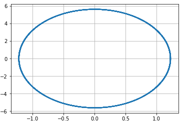
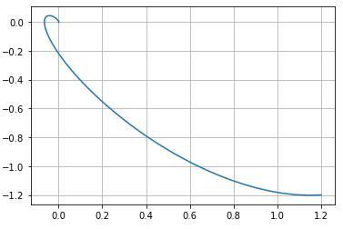
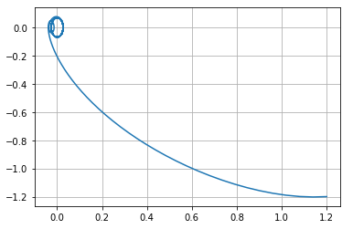

---
## Front matter
lang: ru-RU
title: "Отчет по лабораторной работе 4"
author: |
	Савченков Д.А.\inst{1}
institute: |
	\inst{1}RUDN University, Moscow, Russian Federation
date: 06 March, 2021 Moscow, Russian Federation

## Formatting
toc: false
slide_level: 2
theme: metropolis
header-includes: 
 - \metroset{progressbar=frametitle,sectionpage=progressbar,numbering=fraction}
 - '\makeatletter'
 - '\beamer@ignorenonframefalse'
 - '\makeatother'
aspectratio: 43
section-titles: true
---

# **Прагматика выполнения лабораторной работы**

## Зачем?

Каждый, занимающийся математическим моделированием, должен уметь:

* Использовать математический аппарат для решения задач
* Моделировать задачи

# **Цель выполнения лабораторной работы**

## Цель

Построить модель гармонических колебаний с помощью Python.

# **Задачи выполнения лабораторной работы**

## Задание. Вариант 38

Постройте фазовый портрет гармонического осциллятора и решение уравнения гармонического осциллятора для следующих случаев:

1. Колебания гармонического осциллятора без затуханий и без действий внешней силы $\ddot {x} + 21x = 0$

2. Колебания гармонического осциллятора c затуханием и без действий внешней силы $\ddot {x} + 2.2 \dot {x} + 2.3x = 0$

3. Колебания гармонического осциллятора c затуханием и под действием внешней силы $\ddot {x} + 2.4 \dot {x} + 2.5x = 0.2 \sin (2.6t)$

На интервале $t \in [0; 72]$ (шаг 0,05) с начальными условиями $x_0 = 1.2, y_0 = -1.2$

# **Результаты выполнения лабораторной работы**

## График колебаний без затуханий и без действий внешней силы

{ #fig:001 width=70% } 

## График колебаний c затуханием и без действий внешней силы

{ #fig:002 width=70% }

## График колебаний c затуханием и под действием внешней силы

{ #fig:003 width=70% }

## Выводы

Построил модель гармонических колебаний с помощью Python.

## {.standout}

Спасибо за внимание!
