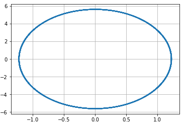
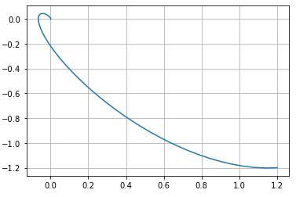
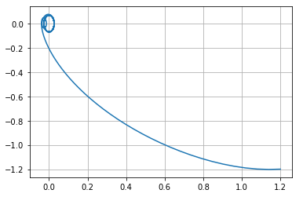

---
# Front matter
lang: ru-RU
title: "Отчёт по лабораторной работе 4"
subtitle: "дисциплина: Математическое моделирование"
author: "Савченков Д.А., НПИбд-02-18"

# Formatting
toc-title: "Содержание"
toc: true # Table of contents
toc_depth: 2
lof: true # List of figures
lot: true # List of tables
fontsize: 12pt
linestretch: 1.5
papersize: a4paper
documentclass: scrreprt
polyglossia-lang: russian
polyglossia-otherlangs: english
mainfont: PT Serif
romanfont: PT Serif
sansfont: PT Sans
monofont: PT Mono
mainfontoptions: Ligatures=TeX
romanfontoptions: Ligatures=TeX
sansfontoptions: Ligatures=TeX,Scale=MatchLowercase
monofontoptions: Scale=MatchLowercase
indent: true
pdf-engine: lualatex
header-includes:
  - \linepenalty=10 # the penalty added to the badness of each line within a paragraph (no associated penalty node) Increasing the value makes tex try to have fewer lines in the paragraph.
  - \interlinepenalty=0 # value of the penalty (node) added after each line of a paragraph.
  - \hyphenpenalty=50 # the penalty for line breaking at an automatically inserted hyphen
  - \exhyphenpenalty=50 # the penalty for line breaking at an explicit hyphen
  - \binoppenalty=700 # the penalty for breaking a line at a binary operator
  - \relpenalty=500 # the penalty for breaking a line at a relation
  - \clubpenalty=150 # extra penalty for breaking after first line of a paragraph
  - \widowpenalty=150 # extra penalty for breaking before last line of a paragraph
  - \displaywidowpenalty=50 # extra penalty for breaking before last line before a display math
  - \brokenpenalty=100 # extra penalty for page breaking after a hyphenated line
  - \predisplaypenalty=10000 # penalty for breaking before a display
  - \postdisplaypenalty=0 # penalty for breaking after a display
  - \floatingpenalty = 20000 # penalty for splitting an insertion (can only be split footnote in standard LaTeX)
  - \raggedbottom # or \flushbottom
  - \usepackage{float} # keep figures where there are in the text
  - \floatplacement{figure}{H} # keep figures where there are in the text
---

# Цель работы

Построить модель гармонических колебаний с помощью Python.

# Задание

**Вариант 38**
Постройте фазовый портрет гармонического осциллятора и решение уравнения гармонического осциллятора для следующих случаев:

1. Колебания гармонического осциллятора без затуханий и без действий внешней силы $\ddot {x} + 21x = 0$

2. Колебания гармонического осциллятора c затуханием и без действий внешней силы $\ddot {x} + 2.2 \dot {x} + 2.3x = 0$

3. Колебания гармонического осциллятора c затуханием и под действием внешней силы $\ddot {x} + 2.4 \dot {x} + 2.5x = 0.2 \sin (2.6t)$

На интервале $t \in [0; 72]$ (шаг 0,05) с начальными условиями $x_0 = 1.2, y_0 = -1,2$

# Выполнение лабораторной работы

**1. Колебания без затуханий и без действий внешней силы**

1.1. Уравнение свободных колебаний гармонического осциллятора имеет следующий вид:
$$ \ddot {x} + 2 \gamma \dot {x} + \omega _0^2x = f(t) $$

Изучил начальные условия. Перед нами уравнение консервативного осциллятора, энергия колебания которого сохраняется во времени. Т. е. потери в системе 
отсутствуют, значит, $\gamma = 0$. Собственная частота колебаний $\omega = 21$. $x_{0} = 1,2, y_{0} = -1,2$. Правая часть уравнения $f(t) = 0$.

1.2. Оформил начальные условия в код на Python:
```
x0 = np.array([1.2, -1.2])

w1 = 21 #частота, уже в квадрате
g1 = 0.0 #затухание, уже умноженное на 2

def F1(t):
    f = 0
    return f
```

1.3. Решение ищем на интервале $t \in [0; 72]$ (шаг 0,05), значит, $t_{0} = 0$ -- начальный момент времени, $t_{max} = 37$ -- предельный момент времени, 
$dt = 0,05$ -- шаг изменения времени.

1.4. Добавил в программу условия, описывающие время:
```
t0 = 0
tmax = 72
dt = 0.05
t = np.arange(t0, tmax, dt)
```

1.5. Представил заданное уравнение второго порядка в виде системы двух уравнений первого порядка и запрограммировал: 
```
def Y1(x, t):
    dx1_1 = x[1]
    dx1_2 = - w1*x[0] - g1*x[1] - F1(t)
    return dx1_1, dx1_2
```

1.6. Запрограммировал решение системы уравнений:
```
x1 = odeint(Y1, x0, t)
```

1.7. Переписал отдельно $x$ в $y_1$, а $\dot {x}$ в $y_2$:
```
y1_1 = x1[:, 0]
y1_2 = x1[:, 1]
```

1.8. Описал построение фазового портрета:
```
plt.plot(y1_1, y1_2)
```

**2. Колебания c затуханием и без действий внешней силы**

2.1. Изучил начальные условия. Потери энергии в системе $\gamma = 2,2$. Собственная частота колебаний $\omega = 2,3$. $x_{0}$ и $y_{0}$ те же, что и в п. 1.1. 
Правая часть уравнения такая же, как и в п. 1.1.

2.2. Т. к. вектор начальных условий одинаков для всех пунктов задачи, задаю его один раз в начале. Остальные начальные условия оформил в код на Python 
(функцию F1 переименовал в F12, т. к. она подходит как для 1-ого, так и для 2-ого случаев):
```
w2 = 2.3
g2 = 2.2

def F12(t):
    f = 0
    return f
```

2.3. Т. к. интервал, на котором ищем решение, одинаков для всех пунктов задачи, задаю его один раз в начале.

2.4. Представил заданное уравнение второго порядка в виде системы двух уравнений первого порядка и запрограммировал: 
```
def Y2(x, t):
    dx2_1 = x[1]
    dx2_2 = - w2*x[0] - g2*x[1] - F12(t)
    return dx2_1, dx2_2
```

2.5. Запрограммировал решение системы уравнений:
```
x2 = odeint(Y2, x0, t)
```

2.6. Переписал отдельно $x$ в $y_1$, а $\dot {x}$ в $y_2$:
```
y2_1 = x2[:, 0]
y2_2 = x2[:, 1]
```

2.7. Описал построение фазового портрета:
```
plt.plot(y2_1, y2_2)
```

**3. Колебания c затуханием и под действием внешней силы**

3.1. Изучил начальные условия. Потери энергии в системе $\gamma = 2,4$. Собственная частота колебаний $\omega = 2,5$. $x_{0}$ и $y_{0}$ те же, что и в п. 1.1. 
Правая часть уравнения $f(t) = 0,2 \sin (2,6t)$.

3.2. Т. к. вектор начальных условий одинаков для всех пунктов задачи, задаю его один раз в начале. Остальные начальные условия оформил в код на Python:
```
w3 = 2.5
g3 = 2.4

def F3(t):
    f = 0.2*np.sin(2.6*t)
    return f
```

3.3. Т. к. интервал, на котором ищем решение, одинаков для всех пунктов задачи, задаю его один раз в начале.

3.4. Представил заданное уравнение второго порядка в виде системы двух уравнений первого порядка и запрограммировал: 
```
def Y3(x, t):
    dx3_1 = x[1]
    dx3_2 = - w3*x[0] - g3*x[1] - F3(t)
    return dx3_1, dx3_2
```

3.5. Запрограммировал решение системы уравнений:
```
x3 = odeint(Y3, x0, t)
```

3.6. Переписал отдельно $x$ в $y_1$, а $\dot {x}$ в $y_2$:
```
y3_1 = x3[:, 0]
y3_2 = x3[:, 1]
```

3.7. Описал построение фазового портрета:
```
plt.plot(y3_1, y3_2)
```

**4. Сборка программы**

4.1. Собрал код программы воедино и получила следующее:
```
import math
import numpy as np
from scipy.integrate import odeint
import matplotlib.pyplot as plt

x0 = np.array([1.2, -1.2]) #вектор начальных условий

w1 = 21 #частота, уже в квадрате
g1 = 0.0 #затухание, уже умноженное на 2

w2 = 2.3
g2 = 2.2

w3 = 2.5
g3 = 2.4

def F12(t):
    f = 0
    return f

def F3(t):
    f = 0.2*np.sin(2.6*t)
    return f

t0 = 0
tmax = 72
dt = 0.05
t = np.arange(t0, tmax, dt)

def Y1(x, t):
    dx1_1 = x[1]
    dx1_2 = - w1*x[0] - g1*x[1] - F12(t)
    return dx1_1, dx1_2

def Y2(x, t):
    dx2_1 = x[1]
    dx2_2 = - w2*x[0] - g2*x[1] - F12(t)
    return dx2_1, dx2_2

def Y3(x, t):
    dx3_1 = x[1]
    dx3_2 = - w3*x[0] - g3*x[1] - F3(t)
    return dx3_1, dx3_2

x1 = odeint(Y1, x0, t)
x2 = odeint(Y2, x0, t)
x3 = odeint(Y3, x0, t)

y1_1 = x1[:, 0]
y1_2 = x1[:, 1]

y2_1 = x2[:, 0]
y2_2 = x2[:, 1]

y3_1 = x3[:, 0]
y3_2 = x3[:, 1]

plt.plot(y1_1, y1_2)
plt.grid(axis = 'both')

plt.plot(y2_1, y2_2)
plt.grid(axis = 'both')

plt.plot(y3_1, y3_2)
plt.grid(axis = 'both')
```

4.2. Получил фазовые портреты гармонического осциллятора (см. рис. -@fig:001, -@fig:002 и -@fig:003):

{ #fig:001 width=70% }

{ #fig:002 width=70% }

{ #fig:003 width=70% }

# Выводы

Построил модель гармонических колебаний с помощью Python.

# Ответы на вопросы к лабораторной работе

*1. Запишите простейшую модель гармонических колебаний*

Простейшим видом колебательного процесса являются простые гармонические колебания, которые описываются уравнением $x = x_m cos (\omega t + \varphi _0)$. 

*2. Дайте определение осциллятора*

Осциллятор — система, совершающая колебания, то есть показатели которой периодически повторяются во времени.

*3. Запишите модель математического маятника*

Уравнение динамики принимает вид: 
$$\frac{\partial ^2 \alpha}{\partial t^2} + \frac{g}{L} sin{\alpha} = 0$$ 
В случае малых колебаний полагают $\sin(\alpha ) ≈ \alpha$. В результате возникает линейное дифференциальное уравнение 
$$\frac{\partial ^2 \alpha}{\partial t^2} + \frac{g}{L} \alpha = 0$$ или $$\frac{\partial ^2 \alpha}{\partial t^2} + \omega ^2 \alpha = 0$$

*4. Запишите алгоритм перехода от дифференциального уравнения второго порядка к двум дифференциальным уравнениям первого порядка*

Пусть у нас есть дифференциальное уравнение 2-го порядка:
$$ \ddot {x} + \omega _0^2x = f(t) $$

Для перехода к системе уравнений первого порядка сделаем замену (это метод Ранге-Кутты):
$$ y = \dot{x} $$

Тогда получим систему уравнений:
  \begin{equation*} 
    \begin{cases}
      y = \dot{x}
      \\ 
      \dot{y} = - \omega _0^2x
    \end{cases}
  \end{equation*} 

*5. Что такое фазовый портрет и фазовая траектория?*

Фазовый портрет — это то, как величины, описывающие состояние системы (= динамические переменные), зависят друг от друга.

Фазовая траектория — кривая в фазовом пространстве, составленная из точек, представляющих состояние динамической системы в последовательные моменты времени 
в течение всего времени эволюции.
