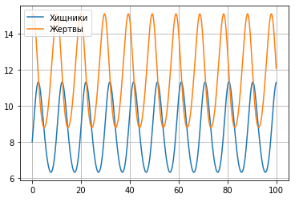
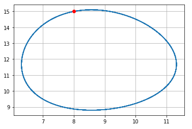

---
# Front matter
lang: ru-RU
title: "Отчёт по лабораторной работе 5"
subtitle: "дисциплина: Математическое моделирование"
author: "Савченков Д.А., НПИбд-02-18"

# Formatting
toc-title: "Содержание"
toc: true # Table of contents
toc_depth: 2
lof: true # List of figures
lot: true # List of tables
fontsize: 12pt
linestretch: 1.5
papersize: a4paper
documentclass: scrreprt
polyglossia-lang: russian
polyglossia-otherlangs: english
mainfont: PT Serif
romanfont: PT Serif
sansfont: PT Sans
monofont: PT Mono
mainfontoptions: Ligatures=TeX
romanfontoptions: Ligatures=TeX
sansfontoptions: Ligatures=TeX,Scale=MatchLowercase
monofontoptions: Scale=MatchLowercase
indent: true
pdf-engine: lualatex
header-includes:
  - \linepenalty=10 # the penalty added to the badness of each line within a paragraph (no associated penalty node) Increasing the value makes tex try to have fewer lines in the paragraph.
  - \interlinepenalty=0 # value of the penalty (node) added after each line of a paragraph.
  - \hyphenpenalty=50 # the penalty for line breaking at an automatically inserted hyphen
  - \exhyphenpenalty=50 # the penalty for line breaking at an explicit hyphen
  - \binoppenalty=700 # the penalty for breaking a line at a binary operator
  - \relpenalty=500 # the penalty for breaking a line at a relation
  - \clubpenalty=150 # extra penalty for breaking after first line of a paragraph
  - \widowpenalty=150 # extra penalty for breaking before last line of a paragraph
  - \displaywidowpenalty=50 # extra penalty for breaking before last line before a display math
  - \brokenpenalty=100 # extra penalty for page breaking after a hyphenated line
  - \predisplaypenalty=10000 # penalty for breaking before a display
  - \postdisplaypenalty=0 # penalty for breaking after a display
  - \floatingpenalty = 20000 # penalty for splitting an insertion (can only be split footnote in standard LaTeX)
  - \raggedbottom # or \flushbottom
  - \usepackage{float} # keep figures where there are in the text
  - \floatplacement{figure}{H} # keep figures where there are in the text
---

# Цель работы

Построить модель Лотки-Вольтерры типа "хищник -- жертва" с помощью Python.

# Задание

**Вариант 38**

Для модели «хищник-жертва»:

$$
\begin{cases}
    \frac{\partial x}{\partial t} = -0.7x(t)+0.06x(t)y(t)
    \\
    \frac{\partial y}{\partial t} = 0.6y(t)-0.07x(t)y(t)
\end{cases}
$$

Постройте график зависимости численности хищников от численности жертв, а также графики изменения численности хищников и численности жертв при следующих 
начальных условиях: $x_0 = 8, y_0 = 15$. Найдите стационарное состояние системы.

# Выполнение лабораторной работы

1. Полагаем для этой модели, что $x$ -- число жертв, а $y$ -- число хищников. Изучил начальные условия. Коэффициент 0,7 описывает скорость естественного 
прироста числа жертв в отсутствие хищников, 0,6 -- естественное вымирание хищников, лишенных пищи в виде жертв. Вероятность взаимодействия жертвы и хищника 
считается пропорциональной как количеству жертв, так и числу самих хищников $(xy)$. Каждый акт взаимодействия уменьшает популяцию жертв, но способствует 
увеличению популяции хищников (коэффициенты 0,06 и 0,07). Стационарное состояние будет в точке: $x_0 = 8, y_0 = 15$.

2. Оформил начальные условия в код на Python:
```
x0 = [8, 15]

a = 0.7
b = 0.06
c = 0.6
d = 0.07
```

3. Решение для колебаний изменения числа популяции хищников и жертв искал на интервале $t \in [0; 100]$ (шаг 0,1), значит, $t_{0} = 0$ -- начальный момент 
времени, $t_{max} = 37$ -- предельный момент времени, $dt = 0,05$ -- шаг изменения времени.

4. Добавил в программу условия, описывающие время:
```
t0 = 0
tmax = 100
dt = 0.1
t = np.arange(t0, tmax, dt)
```

5. Запрограммировал заданную систему уравнений: 
```
def S(x, t):
    dx0 = -a*x[0] + b*x[0]*x[1]
    dx1 = c*x[1] - d*x[0]*x[1]
    return dx0, dx1
```

6. Запрограммировал решение системы уравнений:
```
y = odeint(S, x0, t)
```

7. Переписал отдельно $x$ (жертв) в $y_1$, а $y$ (хищников) в $y_2$:
```
y1 = y[:,0]
y2 = y[:,1]
```

8. Описал построение графика колебаний изменения числа популяции хищников и жертв:
```
plt.plot(t, y1, label='Хищники')
plt.plot(t, y2, label='Жертвы')
plt.legend()
plt.grid(axis = 'both')
```

9. Описал построение графика зависимости изменения численности хищников от изменения численности жертв:
```
plt.plot(y1, y2)
plt.grid(axis = 'both')
```

10. Добавил на второй график обозначение стационарного состояния:
```
plt.plot(x0[0], x0[1], 'ro')
```

11. Собрал код программы воедино и получил следующее:
```
import math
import numpy as np
from scipy.integrate import odeint
import matplotlib.pyplot as plt

x0 = [8, 15]

a = 0.7
b = 0.06
c = 0.6
d = 0.07

t0 = 0
tmax = 100
dt = 0.1
t = np.arange(t0, tmax, dt)

def S(x, t):
    dx0 = -a*x[0] + b*x[0]*x[1]
    dx1 = c*x[1] - d*x[0]*x[1]
    return dx0, dx1

y = odeint(S, x0, t)

y1 = y[:,0]
y2 = y[:,1]

plt.plot(t, y1, label='Хищники')
plt.plot(t, y2, label='Жертвы')
plt.legend()
plt.grid(axis = 'both')

plt.plot(y1, y2)
plt.plot(x0[0], x0[1], 'ro')
plt.grid(axis = 'both')
```

12. Получил графики колебаний изменения числа популяции хищников и жертв (см. рис. -@fig:001), а также график зависимости изменения численности хищников 
от изменения численности жертв (см. рис. -@fig:002):

{ #fig:001 width=70% }

{ #fig:002 width=70% }

# Выводы

Построил модель Лотки-Вольтерры типа "хищник -- жертва" с помощью Python.