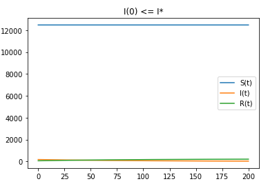
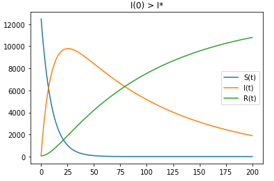

---
# Front matter
lang: ru-RU
title: "Отчёт по лабораторной работе 6"
subtitle: "дисциплина: Математическое моделирование"
author: "Савченков Д.А., НПИбд-02-18"

# Formatting
toc-title: "Содержание"
toc: true # Table of contents
toc_depth: 2
lof: true # List of figures
lot: true # List of tables
fontsize: 12pt
linestretch: 1.5
papersize: a4paper
documentclass: scrreprt
polyglossia-lang: russian
polyglossia-otherlangs: english
mainfont: PT Serif
romanfont: PT Serif
sansfont: PT Sans
monofont: PT Mono
mainfontoptions: Ligatures=TeX
romanfontoptions: Ligatures=TeX
sansfontoptions: Ligatures=TeX,Scale=MatchLowercase
monofontoptions: Scale=MatchLowercase
indent: true
pdf-engine: lualatex
header-includes:
  - \linepenalty=10 # the penalty added to the badness of each line within a paragraph (no associated penalty node) Increasing the value makes tex try to have fewer lines in the paragraph.
  - \interlinepenalty=0 # value of the penalty (node) added after each line of a paragraph.
  - \hyphenpenalty=50 # the penalty for line breaking at an automatically inserted hyphen
  - \exhyphenpenalty=50 # the penalty for line breaking at an explicit hyphen
  - \binoppenalty=700 # the penalty for breaking a line at a binary operator
  - \relpenalty=500 # the penalty for breaking a line at a relation
  - \clubpenalty=150 # extra penalty for breaking after first line of a paragraph
  - \widowpenalty=150 # extra penalty for breaking before last line of a paragraph
  - \displaywidowpenalty=50 # extra penalty for breaking before last line before a display math
  - \brokenpenalty=100 # extra penalty for page breaking after a hyphenated line
  - \predisplaypenalty=10000 # penalty for breaking before a display
  - \postdisplaypenalty=0 # penalty for breaking after a display
  - \floatingpenalty = 20000 # penalty for splitting an insertion (can only be split footnote in standard LaTeX)
  - \raggedbottom # or \flushbottom
  - \usepackage{float} # keep figures where there are in the text
  - \floatplacement{figure}{H} # keep figures where there are in the text
---

# Цель работы

Построить простейшую модель эпидемии с помощью Python.

# Задание

**Вариант 38**

На одном острове вспыхнула эпидемия. Известно, что из всех проживающих на острове ($N = 12700$) в момент начала эпидемии ($t = 0$) число заболевших людей
(являющихся распространителями инфекции) $I(0) = 170$, а число здоровых людей с иммунитетом к болезни $R(0) = 57$. Таким образом, число людей восприимчивых к
болезни, но пока здоровых, в начальный момент времени $S(0) = N - I(0) - R(0)$.

Постройте графики изменения числа особей в каждой из трех групп.
Рассмотрите, как будет протекать эпидемия в случае:

1) если $I(0) \leq I^*$

2) если $I(0) > I^*$

# Теоретическое введение

Предположим, что некая популяция, состоящая из N особей, (считаем, что популяция изолирована) подразделяется на три группы:

- $S(t)$ — восприимчивые к болезни, но пока здоровые особи;

- $I(t)$ — это число инфицированных особей, которые также при этом являются распространителями инфекции;

- $R(t)$ — это здоровые особи с иммунитетом к болезни. 

До того, как число заболевших не превышает критического значения $I^*$ считаем, что все больные изолированы и не заражают здоровых. Когда $I(t) > I^*$, тогда 
инфицирование способны заражать восприимчивых к болезни особей.

Таким образом, скорость изменения числа S(t) меняется по следующему закону:

$$ \frac{\partial S}{\partial t} = \begin{cases} - \alpha S, если I(t)>I^* \\ 0, если I(t) \leq I^* \end{cases}$$

Поскольку каждая восприимчивая к болезни особь, которая в конце концов заболевает, сама становится инфекционной, то скорость изменения числа инфекционных 
особей представляет разность за единицу времени между заразившимися и теми, кто уже болеет и лечится, т.е.:

$$ \frac{\partial I}{\partial t} = \begin{cases} - \alpha S - \beta I, если I(t)>I^* \\ - \beta I, если I(t) \leq I^* \end{cases}$$

А скорость изменения выздоравливающих особей (при этом приобретающие иммунитет к болезни):

$$ \frac{\partial R}{\partial t} = \beta I$$

Постоянные пропорциональности:

- $\alpha$ — коэффициент заболеваемости

- $\beta$ — коэффициент выздоровления

Для того, чтобы решения соответствующих уравнений определялись однозначно, необходимо задать начальные условия. Считаем, что на начало эпидемии в момент 
времени $t = 0$ нет особей с иммунитетом к болезни $R(0) = 0$, а число инфицированных и восприимчивых к болезни особей $I(0)$ и $S(0)$ соответственно. 
Для анализа картины протекания эпидемии необходимо рассмотреть два случая: $I(0) \leq I^*$ и $I(0) > I^*$.

# Выполнение лабораторной работы

1. Изучил начальные условия. Популяция состоит из 12700 особей. В начальный момент времени: 170 особей инфицированы; 57 здоровая особь с иммунитетом; 
(12700 - 170 - 57) особей, воприимчивых к болезни. Задал коэффициент заболеваемости, равный 0,1, и коэффициент выздоровления, равный 0,01.

2. Оформил начальные условия в код на Python:
```
a = 0.1
b = 0.01

N = 12700
I0 = 170
R0 = 57
S0 = N - I0 - R0
x0 = [S0, I0, R0]
```

3. Задал условия для времени: $t_{0} = 0$ -- начальный момент времени, $t_{max} = 200$ -- предельный момент времени, $dt = 0,01$ -- шаг изменения времени.

4. Добавил в программу условия, описывающие время:
```
t0 = 0
tmax = 200
dt = 0.01
t = np.arange(t0, tmax, dt)
```

5. Запрограммировал систему уравнений, соответствующую 1-ому случаю ($I(0) \leq I^*$): 
```
def S1(x, t):
    dx1_0 = 0
    dx1_1 = - b*x[1]
    dx1_2 = b*x[1]
    return dx1_0, dx1_1, dx1_2
```

6. Запрограммировал систему уравнений, соответствующую 2-ому случаю ($I(0) > I^*$): 
```
def S2(x, t):
    dx2_0 = -a*x[0]
    dx2_1 = a*x[0] - b*x[1]
    dx2_2 = b*x[1]
    return dx2_0, dx2_1, dx2_2
```

7. Запрограммировал решение систем уравнений:
```
y1 = odeint(S1, x0, t)
y2 = odeint(S2, x0, t)
```

8. Описал построение графика для 1-ого случая ($I(0) \leq I^*$):
```
plt.plot(t, y1[:,0], label='S(t)')
plt.plot(t, y1[:,1], label='I(t)')
plt.plot(t, y1[:,2], label='R(t)')
plt.title('I(0) <= I*')
plt.legend()
```

9. Описал построение графика для 2-ого случая ($I(0) > I^*$):
```
plt.plot(t, y2[:,0], label='S(t)')
plt.plot(t, y2[:,1], label='I(t)')
plt.plot(t, y2[:,2], label='R(t)')
plt.title('I(0) > I*')
plt.legend()
```

10. Собрал код программы воедино и получил следующее:
```
import math
import numpy as np
from scipy.integrate import odeint
import matplotlib.pyplot as plt

a = 0.1
b = 0.01

N = 12700
I0 = 170
R0 = 57
S0 = N - I0 - R0
x0 = [S0, I0, R0]

t0 = 0
tmax = 200
dt = 0.01
t = np.arange(t0, tmax, dt)

def S1(x, t):
    dx1_0 = 0
    dx1_1 = - b*x[1]
    dx1_2 = b*x[1]
    return dx1_0, dx1_1, dx1_2

def S2(x, t):
    dx2_0 = -a*x[0]
    dx2_1 = a*x[0] - b*x[1]
    dx2_2 = b*x[1]
    return dx2_0, dx2_1, dx2_2

y1 = odeint(S1, x0, t)
y2 = odeint(S2, x0, t)

plt.plot(t, y1[:,0], label='S(t)')
plt.plot(t, y1[:,1], label='I(t)')
plt.plot(t, y1[:,2], label='R(t)')
plt.title('I(0) <= I*')
plt.legend()

plt.plot(t, y2[:,0], label='S(t)')
plt.plot(t, y2[:,1], label='I(t)')
plt.plot(t, y2[:,2], label='R(t)')
plt.title('I(0) > I*')
plt.legend()
```

11. Получил следующие динамики изменения числа людей из каждой группы (см. рис. -@fig:001 и -@fig:002):

{ #fig:001 width=70% }

{ #fig:002 width=70% }

# Выводы

Построил простейшую модель эпидемии с помощью Python.

В обоих случаях люди острова смогут победить болезнь.