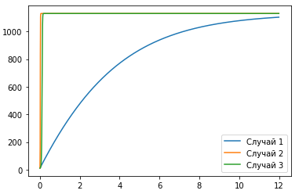
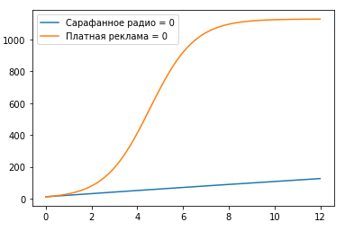
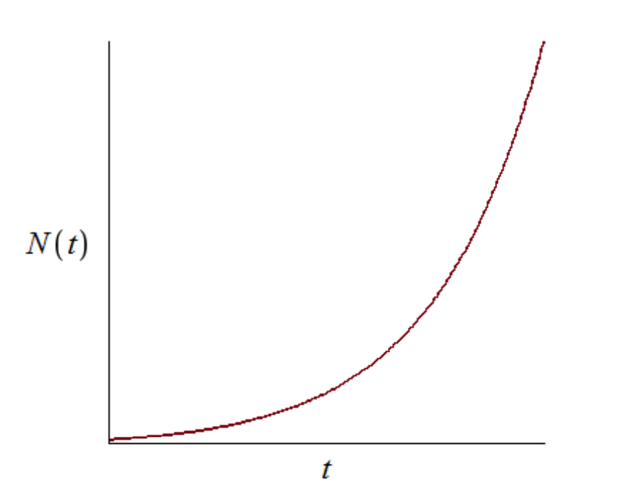
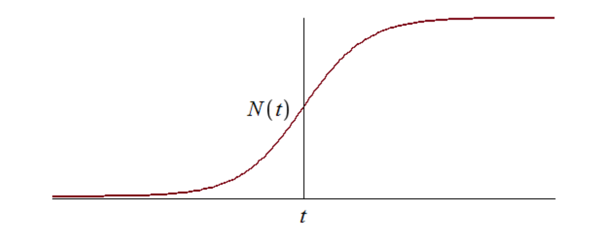

---
# Front matter
lang: ru-RU
title: "Отчёт по лабораторной работе 7"
subtitle: "дисциплина: Математическое моделирование"
author: "Савченков Д.А., НПИбд-02-18"

# Formatting
toc-title: "Содержание"
toc: true # Table of contents
toc_depth: 2
lof: true # List of figures
lot: true # List of tables
fontsize: 12pt
linestretch: 1.5
papersize: a4paper
documentclass: scrreprt
polyglossia-lang: russian
polyglossia-otherlangs: english
mainfont: PT Serif
romanfont: PT Serif
sansfont: PT Sans
monofont: PT Mono
mainfontoptions: Ligatures=TeX
romanfontoptions: Ligatures=TeX
sansfontoptions: Ligatures=TeX,Scale=MatchLowercase
monofontoptions: Scale=MatchLowercase
indent: true
pdf-engine: lualatex
header-includes:
  - \linepenalty=10 # the penalty added to the badness of each line within a paragraph (no associated penalty node) Increasing the value makes tex try to have fewer lines in the paragraph.
  - \interlinepenalty=0 # value of the penalty (node) added after each line of a paragraph.
  - \hyphenpenalty=50 # the penalty for line breaking at an automatically inserted hyphen
  - \exhyphenpenalty=50 # the penalty for line breaking at an explicit hyphen
  - \binoppenalty=700 # the penalty for breaking a line at a binary operator
  - \relpenalty=500 # the penalty for breaking a line at a relation
  - \clubpenalty=150 # extra penalty for breaking after first line of a paragraph
  - \widowpenalty=150 # extra penalty for breaking before last line of a paragraph
  - \displaywidowpenalty=50 # extra penalty for breaking before last line before a display math
  - \brokenpenalty=100 # extra penalty for page breaking after a hyphenated line
  - \predisplaypenalty=10000 # penalty for breaking before a display
  - \postdisplaypenalty=0 # penalty for breaking after a display
  - \floatingpenalty = 20000 # penalty for splitting an insertion (can only be split footnote in standard LaTeX)
  - \raggedbottom # or \flushbottom
  - \usepackage{float} # keep figures where there are in the text
  - \floatplacement{figure}{H} # keep figures where there are in the text
---

# Цель работы

Построить модель рекламной кампании с помощью Python.

# Задание

**Вариант 38**

Постройте график распространения рекламы, математическая модель которой описывается следующим уравнением:

- $\frac{\partial n}{\partial t} = (0.25 + 0.000075n(t))(N - n(t))$
- $\frac{\partial n}{\partial t} = (0.000075 + 0.25n(t))(N - n(t))$
- $\frac{\partial n}{\partial t} = (0.25sin(t) + 0.75*t*n(t))(N - n(t))$

При этом объем аудитории $N$ = 1130, в начальный момент о товаре знает 11 человек. Для случая 2 определите в какой момент времени скорость распространения 
рекламы будет иметь максимальное значение.

1. Построить график распространения рекламы о салоне красоты.
2. Сравнить эффективность рекламной кампании при $\alpha_1(t) > \alpha_2(t)$ и $\alpha_1(t) < \alpha_2(t)$.
3. Определить в какой момент времени эффективность рекламы будет иметь максимально быстрый рост.
4. Построить решение, если учитывать вклад только платной рекламы.
5. Построить решение, если предположить, что информация о товаре распространятся только путем «сарафанного радио», сравнить оба решения.

# Теоретическое введение

Организуется рекламная кампания нового товара или услуги. Необходимо, чтобы прибыль будущих продаж с избытком покрывала издержки на рекламу. Вначале расходы 
могут превышать прибыль, поскольку лишь малая часть потенциальных покупателей будет информирована о новинке. Затем, при увеличении числа продаж, возрастает 
и прибыль, и, наконец, наступит момент, когда рынок насытится, и рекламировать товар станет бесполезным.

Предположим, что торговыми учреждениями реализуется некоторая продукция, о которой в момент времени $t$ из числа потенциальных покупателей $N$ знает лишь 
$n$ покупателей. Для ускорения сбыта продукции запускается реклама по радио, телевидению и других средств массовой информации. После запуска рекламной 
кампании информация о продукции начнет распространяться среди потенциальных покупателей путем общения друг с другом. Таким образом, после запуска рекламных 
объявлений скорость изменения числа знающих о продукции людей пропорциональна как числу знающих о товаре покупателей, так и числу покупателей о нем не 
знающих.

Модель рекламной кампании описывается следующими величинами. Считаем, что

$\frac{\partial n}{\partial t}$ — скорость изменения со временем числа потребителей, узнавших о товаре и готовых его купить;

$t$ — время, прошедшее с начала рекламной кампании;

$n(t)$ — число уже информированных клиентов. Эта величина пропорциональна числу покупателей, еще не знающих о нем. Это описывается следующим образом:

$$ \alpha_1(t)(N-n(t)) $$

$N$ — общее число потенциальных платежеспособных покупателей

$\alpha_1(t)>0$ — характеризует интенсивность рекламной кампании (зависит от затрат на рекламу в данный момент времени).

Помимо этого, узнавшие о товаре потребители также распространяют полученную информацию среди потенциальных покупателей, не знающих о нем (в этом случае 
работает т.н. сарафанное радио). Этот вклад в рекламу описывается величиной

$$ \alpha_2(t)n(t)(N-n(t)) $$

эта величина увеличивается с увеличением потребителей узнавших о товаре. 

Математическая модель распространения рекламы описывается уравнением:

$$ \frac{\partial n}{\partial t} = (\alpha_1(t) + \alpha_2(t)n(t))(N - n(t))$$

# Выполнение лабораторной работы

1. Изучил начальные условия. 11 людей знают о товаре в начальный момент времени. Максимальное количество людей, которых может заинтересовать товар, -- 1130.

2. Оформил начальные условия в код на Python:
```
x0 = 11
N = 1130
```

3. Задал условия для времени: $t_{0} = 0$ -- начальный момент времени, $t_{max} = 12$ -- предельный момент времени, $dt = 0,01$ -- шаг изменения времени.

4. Добавил в программу условия, описывающие время:
```
t0 = 0
tmax = 12
dt = 0.01
t = np.arange(t0, tmax, dt)
```

5. Запрограммировал функцию, отвечающую за платную рекламу, для 1, 2 и 3 случаев: 
```
def k1(t):
    g = 0.25
    return g

def k2(t):
    g = 0.000075
    return g

def k3(t):
    g = 0.25*np.sin(t)
    return g
```

6. Запрограммировал функцию, описывающую сарафанное радио, для 1, 2 и 3 случаев: 
```
def p1(t):
    v = 0.000075
    return v

def p2(t):
    v = 0.25
    return v

def p3(t):
    v = 0.75*t
    return v
```

7. Запрограммировал уравнения, описывающие распространение рекламы, для 1, 2 и 3 случаев:
```
def f1(x, t): 
    xd = (k1(t) + p1(t)*x)*(N - x)
    return xd

def f2(x, t): 
    xd = (k2(t) + p2(t)*x)*(N - x)
    return xd

def f3(x, t):
    xd = (k3(t) + p3(t)*x)*(N - x)
    return xd
```
В 1-ом случае $\alpha_1(t) > \alpha_2(t)$, а во 2-ом -- $\alpha_1(t) < \alpha_2(t)$.

8. Добавил в программу функцию, отвечающую за платную рекламу, для 4-ого задания:
```
def k4(t):
    g = 0.01
    return g
```

9. Добавил в программу функцию, описывающую сарафанное радио, для 5-ого задания:
```
def p4(t):
    v = 0.001
    return v
```

10. Запрограммировал уравнение, учитывающие вклад только платной рекламы, для 4-ого задания:
```
def f4(x, t):
    xd = k4(t)*(N - x)
    return xd
```

11. Запрограммировал уравнение, описывающее распространение информации только путем "сарафанного радио", для 5-ого задания:
```
def f5(x, t):
    xd = (p4(t)*x)*(N - x)
    return xd
```

12. Запрограммировал решение всех уравнений:
```
x1 = odeint(f1, x0, t)
x2 = odeint(f2, x0, t)
x3 = odeint(f3, x0, t)
x4 = odeint(f4, x0, t)
x5 = odeint(f5, x0, t)
```

13. Описал построение графиков для 1, 2 и 3 случаев:
```
plt.plot(t, x1, label='Случай 1')
plt.plot(t, x2, label='Случай 2')
plt.plot(t, x3, label='Случай 3')
plt.legend()
```

14. Описал построение графиков для 4 и 5 заданий:
```
plt.plot(t, x4, label='Сарафанное радио = 0')
plt.plot(t, x5, label='Платная реклама = 0')
plt.legend()
```

15. Запрограммировал определение момента времени, в который эффективность рекламы будет иметь максимально быстрый рост:
```
t[np.argmax(x2[1:].transpose()/t[1:]) + 1]
```

16. Собрал код программы воедино и получила следующее:
```
import math
import numpy as np
from scipy.integrate import odeint
import matplotlib.pyplot as plt

x0 = 11
N = 1130

t0 = 0
tmax = 12
dt = 0.01
t = np.arange(t0, tmax, dt)

def k1(t):
    g = 0.25
    return g

def k2(t):
    g = 0.000075
    return g

def k3(t):
    g = 0.25*np.sin(t)
    return g

def k4(t):
    g = 0.01
    return g

def p1(t):
    v = 0.000075
    return v

def p2(t):
    v = 0.25
    return v

def p3(t):
    v = 0.75*t
    return v

def p4(t):
    v = 0.001
    return v

def f1(x, t):
    xd = (k1(t) + p1(t)*x)*(N - x)
    return xd

def f2(x, t):
    xd = (k2(t) + p2(t)*x)*(N - x)
    return xd

def f3(x, t):
    xd = (k3(t) + p3(t)*x)*(N - x)
    return xd

def f4(x, t):
    xd = k4(t)*(N - x)
    return xd

def f5(x, t):
    xd = (p4(t)*x)*(N - x)
    return xd

x1 = odeint(f1, x0, t)
x2 = odeint(f2, x0, t)
x3 = odeint(f3, x0, t)
x4 = odeint(f4, x0, t)
x5 = odeint(f5, x0, t)

plt.plot(t, x1, label='Случай 1')
plt.plot(t, x2, label='Случай 2')
plt.plot(t, x3, label='Случай 3')
plt.legend()

plt.plot(t, x4, label='Сарафанное радио = 0')
plt.plot(t, x5, label='Платная реклама = 0')
plt.legend()

t[np.argmax(x2[1:].transpose()/t[1:]) + 1]
```

17. Получил следующие графики распространения рекламы для 1, 2 и 3 случаев (см. рис. -@fig:001):

{ #fig:001 width=70% }

18. Получил следующие графики для 4 и 5 заданий (см. рис. -@fig:002):

{ #fig:002 width=70% }

# Выводы

Построил модель рекламной кампании с помощью Python.

Выяснил, что рекламная кампания для случая, когда $\alpha_1(t) < \alpha_2(t)$ (2 случай), эффективнее, чем кампания для случая, когда 
$\alpha_1(t) > \alpha_2(t)$ (1 случай).

Определил, что в момент времени $t = 0,1$ эффективность рекламы будет иметь максимально быстрый рост.

Выяснил, что реклама только путем "сарафанного радио" эффективнее только платной рекламы.

# Ответы на вопросы к лабораторной работе

*1. Записать модель Мальтуса (дать пояснение, где используется данная модель)*

$$ \frac{\partial N}{\partial t} = rN $$

где

- $N$ -- исходная численность населения
- $r$ -- коэффициент пропорциональности, для которого $r = b - d$, где
    - $b$ -- коэффициент рождаемости
    - $d$ -- коэффициент смертности
- t -- время

Модель используется в экологии для расчета изменения популяции особей животных.

*2. Записать уравнение логистической кривой (дать пояснение, что описывает данное уравнение)*

$$ \frac{\partial P}{\partial t} = rP(1 - \frac{P}{K}) $$

- $r$ -- характеризует скорость роста (размножения)
- $K$ -- поддерживающая ёмкость среды (то есть, максимально возможная численность популяции)

Исходные предположения для вывода уравнения при рассмотрении популяционной динамики выглядят следующим образом:

- скорость размножения популяции пропорциональна её текущей численности, при прочих равных условиях;
- скорость размножения популяции пропорциональна количеству доступных ресурсов, при прочих равных условиях. Таким образом, второй член уравнения отражает 
конкуренцию за ресурсы, которая ограничивает рост популяции.

*3. На что влияет коэффициент $\alpha_1(t)$ и $\alpha_2(t)$ в модели распространения рекламы*

$\alpha_1(t)$ -- интенсивность рекламной кампании, зависящая от затрат

$\alpha_2(t)$ -- интенсивность рекламной кампании, зависящая от сарафанного радио

*4. Как ведет себя рассматриваемая модель при $\alpha_1(t) \gg \alpha_2(t)$*

При $\alpha_1(t) \gg \alpha_2(t)$ получается модель типа модели Мальтуса (см. рис. -@fig:003):

{ #fig:003 width=70% }

*5. Как ведет себя рассматриваемая модель при $\alpha_1(t) \ll \alpha_2(t)$*

При $\alpha_1(t) \ll \alpha_2(t)$ получаем уравнение логистической кривой (см. рис. -@fig:004):

{ #fig:004 width=70% }